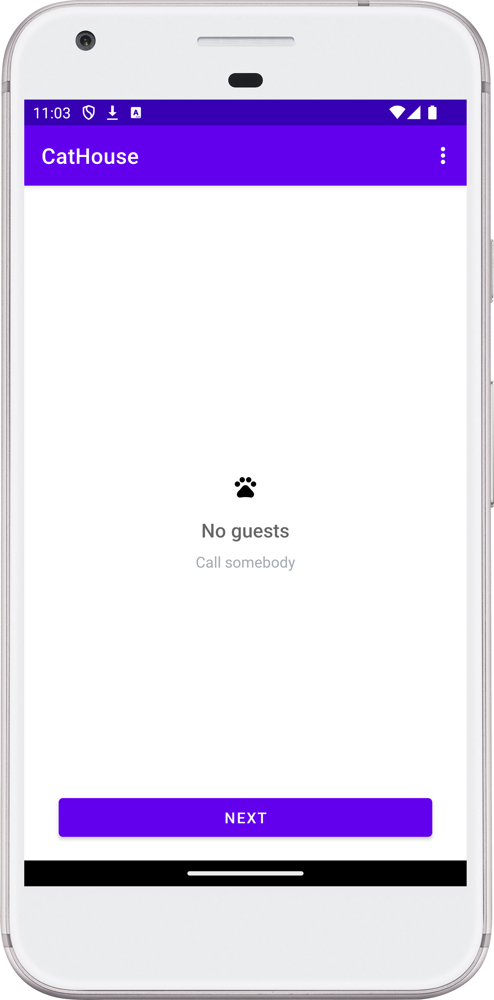
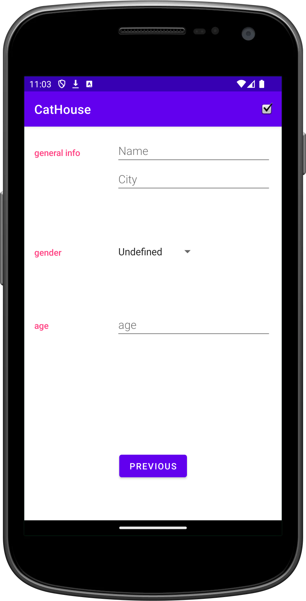
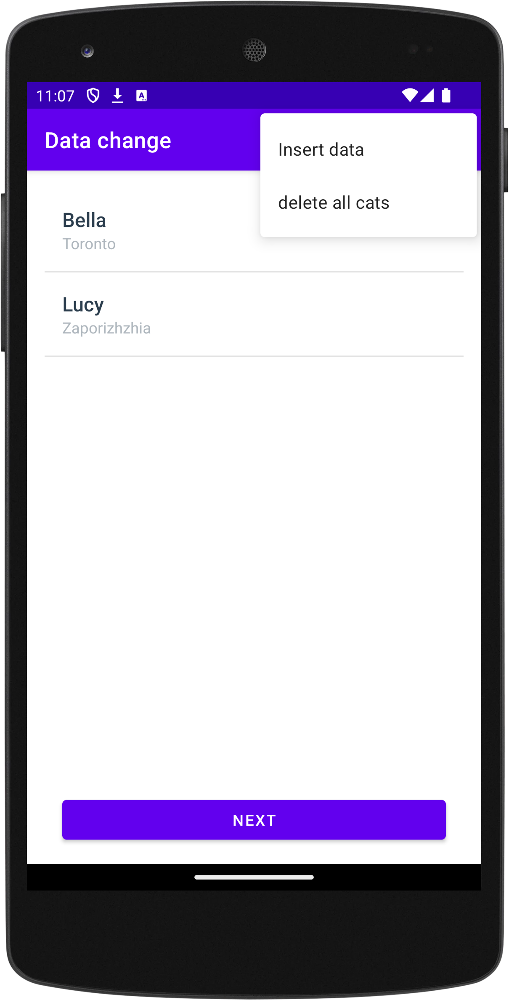

# SQLite Content Provider Sample Android Application

## Description

This project demonstrates how to implement work with SQLite and Content
Provider in an Android application. It features a screen that displays a list
of items (cats) and another screen where users can add a new record (new cat).

## Installation

To install and run this project:

1. Download the project files.
2. Open the project in Android Studio.
3. Run the project on an emulator or a physical Android device.

## Usage

This project can be used for educational purposes and as inspiration if you
need to use SQLite instead of other database libraries like “Room”.

## Features

- [Android](https://developer.android.com/studio/intro)
- [Kotlin](https://kotlinlang.org/)
- SQLite
- ContentResolver
- ContentProvider
- Architectural pattern:
  [Monolith](https://en.wikipedia.org/wiki/Monolithic_application);
- **Code Readability:** code is easily readable with no unnecessary blank
  lines, no unused variables or methods, and no commented-out code, all
  variables, methods, and resource IDs are descriptively named such that
  another developer reading the code can easily understand their function.

## Contributing

Anyone can contribute, but it may not be necessary since this is more of an
educational material for copying and pasting the code.

## License

No intentional license was used.

## Contact:

For any inquiries or suggestions, please open an issue on the GitHub repository
or reach out to me directly at
[dmytro@turskyi.com](mailto:dmytro@turskyi.com).

## Screenshots:

<!--suppress CheckImageSize -->

<!--suppress CheckImageSize -->

<!--suppress CheckImageSize -->

